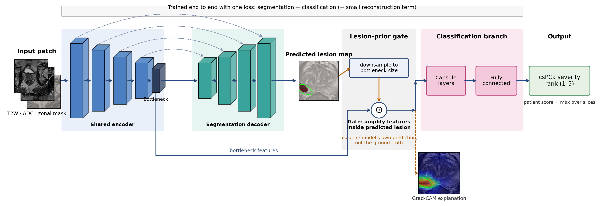

# A Deep Learning Framework for Prostate Cancer Segmentation, Classification and Visual Explanation using Magnetic Resonance Imaging

**A segmentation-led cascade that segments the lesion first, uses its own predicted lesion map to guide clinically significant prostate cancer (csPCa) classification, and provides Grad-CAM visual explanations. Trained and evaluated on the multi-centre PI-CAI dataset.**

This repository contains the code, configuration, fold assignments, evaluation outputs and trained model weights used in my M.Sc. dissertation (Bioinformatics, Covenant University, 2026) and the accompanying manuscript.

---

## The question

Most deep learning models for prostate MRI treat *finding the lesion* (segmentation) and *deciding whether it is clinically significant cancer* (classification) as separate problems, or run them side by side from a shared encoder without either task using the other's output.

This project asks one specific question: **if segmentation runs first and its own prediction is used to guide the classifier, does csPCa classification improve when everything else is held constant?**

To investigate it, I implemented two architectures that share the same encoder, segmentation decoder, capsule classifier, preprocessing, folds, training schedule and evaluation protocol, and differ in how the two heads are connected:

| | Reimplemented baseline (Jiang et al., 2023) | This work |
|---|---|---|
| Encoder, decoder, capsule classifier | same | same |
| How the heads connect | in parallel from the shared bottleneck | **decoder runs first; its predicted lesion map gates the bottleneck before classification** |
| Gate input | — | the model's *own* prediction, never the ground-truth mask |
| Data, folds, preprocessing, augmentation, epochs, metrics | same | same |

The contribution is the segmentation-led routing and its controlled evaluation, not the capsule network, which is inherited from the baseline.

### The gate

`B' = B ⊙ (1 + P̃)`

where `B` is the 6×6×256 bottleneck feature map and `P̃` is the predicted lesion probability map resized to the bottleneck resolution. Because 0 ≤ P̃ ≤ 1, the multiplier ranges from 1 to 2: features inside the predicted lesion are amplified, everything else passes unchanged. The gate uses nothing at training time that would be missing at inference.



## Results (five-fold patient-level cross-validation, 1476 patients)

| Metric | Reimplemented baseline | This work |
|---|---:|---:|
| Segmentation Dice | 0.863 ± 0.006 | 0.860 ± 0.011 |
| csPCa sensitivity (rank ≥ 3) | 78.7 ± 1.9 % | **82.1 ± 6.6 %** |
| csPCa specificity (rank ≥ 3) | 60.4 ± 4.4 % | 58.4 ± 6.5 % |
| Grad-CAM IoU with lesion mask | — | 0.140 |
| Grad-CAM Dice with lesion mask | — | 0.209 |

Grad-CAM overlap was computed against ground-truth lesion masks on all 2149 lesion-positive validation slices.

Segmentation is unchanged (paired t-test on per-fold Dice: p ≈ 0.44, 95% CI −0.009 to +0.005). The sequential design gains 3.4 points of sensitivity and gives up 2.0 points of specificity. With five folds these are descriptive estimates, not proof of superiority. Per-fold numbers, confusion matrices and failure cases are in `results/` and in the manuscript.

## What this is not

- **Not a clinical tool.** Internal cross-validation only; no external cohort, no radiologist study.
- **Not an ablation.** The comparison isolates parallel versus sequential routing. It does not separate the contributions of the gate, the capsule head and the reconstruction head.
- **Not a reproduction of Jiang et al.'s published numbers.** Their architecture was reimplemented from the paper (no code was released) and retrained on PI-CAI under this study's protocol.
- **Not a re-release of PI-CAI data.** The slice cache is regenerated locally from data obtained under PI-CAI's non-commercial CC BY-NC 4.0 terms.

## Known failure mode

Small or low-contrast lesions on which the segmentation decoder does not activate. Because the cascade's guidance signal is the predicted lesion map, weak segmentation gives the classifier no boost and the csPCa probability falls to near zero rather than to a borderline value. Representative cases are in the manuscript (Fig. 8).

## Repository layout

| File | Role |
|---|---|
| `preprocess_picai_cv.py` | Raw PI-CAI volumes → normalised 100×100×3 slice cache (T2W, ADC, zonal mask); ADC resampled onto the T2W grid; intensity clipping at the 0.5th/99.5th percentiles; ISUP-to-rank mapping; patient-level csPCa-stratified fold assignment (seed 42); annotation coverage diagnostic |
| `build_cv_folds.py` | Materialises `fold{k}/train` and `fold{k}/valid` directories and per-fold rank manifests |
| `dataset.py` | Slice dataset and training augmentation (random affine: translation ≤ 8 px, scale 0.9–1.1) |
| `minisegcaps_model.py` | Encoder, decoder, capsule branch, reconstruction head; `forward_seg_first` is the cascade path |
| `capsule_layers.py` | Primary and convolutional capsule layers, dynamic routing, squash |
| `losses.py` | 0.5·Dice + 0.5·BCE (segmentation) + capsule margin loss (classification) + 5×10⁻⁴ masked MSE (reconstruction) |
| `utils.py` | Ordinal encoding: rank → four cumulative threshold bits (≥2, ≥3, ≥4, ≥5) and back |
| `train.py` | Training loop: Adam 2×10⁻³, ×0.8 every 20 epochs, 300 epochs, batch 256, class-balanced sampler |
| `evaluate.py` | Dice; patient-level sensitivity, specificity, accuracy, F1 at rank ≥ 3 and rank ≥ 4 |
| `grad_cam.py` | Grad-CAM at the shared bottleneck, routed through the cascade forward pass |
| `run_gradcam_validation.py` | Grad-CAM over every lesion-positive validation slice with overlap statistics |
| `master_cv_parallel_segfirst.sh` | The exact five-fold run script (train, evaluate, Grad-CAM per fold, one fold per GPU) |
| `dataset_sequence.py` | Slice-sequence loader for a later variant; not used by the runs reported here |

Later, optional flags (`--gate-floor`, `--gate-ceil`, `--capsgru`, `--positive-extra-aug`) exist in the code for follow-up experiments. All default to off; the commands below reproduce the reported run.

## Reproducing the results

**1. Data.** Register at https://pi-cai.grand-challenge.org/ and download the Training and Development Dataset (1500 examinations, 1476 patients; Zenodo record 6624726) and the lesion annotations from https://github.com/DIAGNijmegen/picai_labels. Both are under PI-CAI's CC BY-NC 4.0 terms; nothing from them is redistributed here.

**2. Environment.** Python 3.10+, PyTorch 2.8.0 (CUDA 12.8), SimpleITK, scikit-learn.
```bash
pip install -r requirements.txt
```

**3. Preprocess and build folds.**
```bash
python3 preprocess_picai_cv.py --picai-root /path/to/picai --labels-root /path/to/picai_labels --out cache/
python3 build_cv_folds.py --cv-root cache/
```

**4. Train one fold** (the master script runs all five in parallel, one per GPU). Omit `--seg-first-cascade` to train the parallel baseline.
```bash
python3 train.py --data-root cache/fold0 --balanced --epochs 300 --batch-size 256 \
    --seg-first-cascade --checkpoint-dir ckpts/fold0
```

**5. Evaluate and explain.**
```bash
python3 evaluate.py --data-root cache/fold0 --checkpoint ckpts/fold0/best.pt --split valid --seg-first-cascade
python3 run_gradcam_validation.py --data-root cache/fold0/valid --checkpoint ckpts/fold0/best.pt \
    --out-dir gradcam/fold0 --n-examples -1 --seg-first-cascade
```

**Trained weights** for all five folds are attached to the [Releases](https://github.com/Estherariyo/pi-capsnet-prostate-cancer/releases) page rather than committed, because of their size.

## Design notes

- **Labels.** Case-level ISUP grade group is mapped to a five-level ordinal rank: ISUP 0 → 1, 1 → 2, 2 → 3, 3 → 4, 4 and 5 → 5. A slice carries the case's rank only if it contains annotated lesion pixels; otherwise it is rank 1 (benign). csPCa (ISUP ≥ 2) is therefore rank ≥ 3 and high-grade (ISUP ≥ 3) is rank ≥ 4.
- **Ordinal prediction.** Four output capsules correspond to the thresholds rank ≥ 2, ≥ 3, ≥ 4, ≥ 5; the predicted rank is 1 plus the number of capsules whose length exceeds 0.5. The patient-level csPCa probability is the maximum over the patient's slices. (Variable names in the code say `pirads`; this is inherited naming from the baseline. The labels are ISUP-derived, not PI-RADS.)
- **Why capsules?** The capsule classification branch was retained from the baseline architecture to keep the comparison controlled. The original design uses capsules to represent spatial relationships within MRI features; their contribution was not independently ablated here.
- **Why sensitivity first?** The intended use is triage in settings where subspecialist readers are scarce and a missed cancer costs more than an unnecessary follow-up. Accuracy is reported but not optimised.

## Citation

Manuscript under submission. Until it is published, please cite the dissertation:

> Ariyo EO. A deep learning framework for prostate cancer segmentation, classification and visual explanation using magnetic resonance imaging [M.Sc. dissertation]. Ota, Nigeria: Covenant University; 2026.

Baseline architecture: Jiang W, Lin Y, Vardhanabhuti V, Ming Y, Cao P. Joint cancer segmentation and PI-RADS classification on multiparametric MRI using MiniSegCaps network. *Diagnostics*. 2023;13(4):615.

Dataset: Saha A, et al. Artificial intelligence and radiologists in prostate cancer detection on MRI (PI-CAI): an international, paired, non-inferiority, confirmatory study. *Lancet Oncol*. 2024;25(7):879–87.

## Author

**Esther Opeyemi Ariyo** · ORCID 0000-0003-2102-0273
Department of Computer and Information Sciences / CApIC-ACE, Covenant University, Nigeria
Supervisor: Prof. Jelili O. Oyelade · Co-author: Dr. Jerry Emmanuel

## Licence

Code: MIT (see `LICENSE`). PI-CAI imaging and annotations remain under their own CC BY-NC 4.0 terms and are not included.
